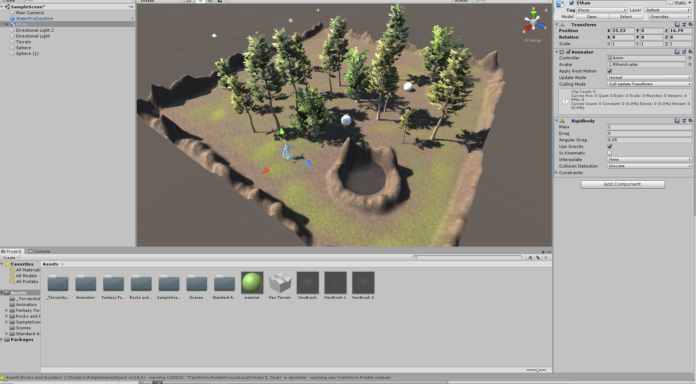

# Introducción a Unity - Aula

-  Incluir dos objetos 3D básicos.
Creamos dos esferas en la escena usando 3D Object -> esfera

-   Incluir un personaje com Ethan, de los Standard Assets.
Importamos Standard Assert en el Assert Store de Unity y arrastramos el personaje Ethan a la escena.

-   Incluir un personaje de la Asset Store.
Incluimos Ethan en la escena

-   Crear un terreno.
Creamos un terreno en la escena 3D object -> terrain.

-   Cada objeto debe tener una etiqueta que lo identifique.
En cada gameobject añadimos una etiqueta en la ventanilla del inspector.

-   La escena debe tener 2 fuentes de luz.
Dublicamos el fuente del luz 

-   Agregar agua y árboles en el terreno
En la ventanilla del inspector del terreno que hemos creado, aparece múltiple opciones para añadir elemento en el terreno y elegimos la opción de añadir arboles,

